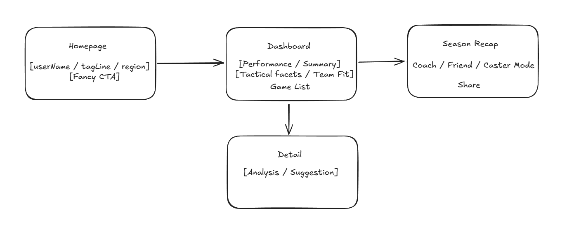

# 🎮 Rift Rewind — Your Playstyle, Reimagined

> **A playful yet coach-grade analytics experience** that turns end-of-game data into **reflection, learning, and celebration**.  
> Your League of Legends career, reimagined as a storybook of growth, tactics, and glory.

---

## 📚 Table of Contents
- [🌟 Project Goal](#-project-goal)
- [🧠 Analysis Objectives](#-analysis-objectives)
  - [🕹️ Single Match Analysis](#️-single-match-analysis)
  - [📊 Career-Level Insights](#-career-level-insights)
  - [🎉 Entertainment & Social Layer](#-entertainment--social-layer)
- [🧩 Frontend](#-frontend)
- [⚙️ Data & Analysis Layer](#️-data--analysis-layer)
- [🧱 Backend & API](#-backend--api)
- [☁️ AWS Integration](#️-aws-integration)
- [🏁 Vision](#-vision)

---

## 🌟 Project Goal

Rift Rewind bridges **data analytics** and **personalized storytelling** to make every summoner’s journey meaningful.  
Through visualized dashboards, AI-driven coaching, and narrative recaps, players can:

- Reflect on **decision-making** and playstyle patterns  
- Identify **tactical strengths and weaknesses**  
- Celebrate **career highlights** with shareable story cards  

---

## 🧠 Analysis Objectives

<b>🕹️ 1. Single Match Analysis</b>

Understand each game’s **flow and decision quality**:  

- **Macro decisions:** rotations, objectives, tempo control  
- **Micro mechanics:** lane mistakes, itemization, ability usage  
- **Team dynamics:** coordination, execution, positioning  
- **Critical errors:** late TP, mistimed flash, bad engage timing  
- Split analysis: *Laning phase* vs *Teamfights*

<b>📊 2. Career-Level Insights</b>

Long-term reflection across hundreds of games:  

- Flash & Summoner Spell efficiency  
- Skillshot accuracy  
- Signature champ performance, “first-time” hero analysis  
- “Carry” and “throw” tendencies  
- Personality & teammate synergy profile  
- Ideal teammates / difficult matchups  
- Training potential — *“What if you were scouted for pro play?”*

<b>🎉 3. Entertainment & Social Layer</b>

Not just stats — it’s **fun and emotional**:  

- “Who carried who” in duo matches  
- Highlight games that bonded friendships  
- Compatibility & synergy scores  
- Playful recap tones: *Coach / Caster / Bro*

---

## 🧩 Frontend

**Tech Stack**

- **Next.js (App Router)** + **TypeScript**  
- **Tailwind CSS** + **shadcn/ui**  
- **Recharts** + **Framer Motion**

---

### 🏠 1) Summoner’s Hall
- Input: `gameName#tagLine + region`  
- CTA: **Generate My Career Analysis**  
- Anime-style **particle transitions**  

### 📈 2) Dashboard
- Main champions, team role, personality (e.g., *Tempo Jungle, Strategy Mid*)  
- Performance metrics: KDA, CS/min, GPM, Vision Score  
- Tactical analysis: Lane Tempo, Teamfights, Objective Control, Vision, Economy  
- Team fit & playstyle summary  
- Recent games list  

### 🔍 3) Single Game Recap
- **Left:** Timeline + map events (kills, wards, objectives)  
- **Center:** AI Coach voice card with feedback  
- **Right:** “What-if” scenarios (e.g., *swap trinket at 8:00 → better Herald control*)  
- **Bottom:** 3-step improvement checklist (“Coach Mode”)  

### 📖 4) Season Recap — *Book of Glory*
- Narrative modes: **Coach / Caster / Bro**  
- Scrollytelling visualization: total games, top champs, power spikes, best duo  
- Generates honor titles + shareable poster cards  

### 🤝 5) Share & Social
- One-click poster generation (choose tone: *coach / fun / caster*)  
- “Battle Card” vs friends  
- Weekly leaderboard  

---

## ⚙️ Data & Analysis Layer

- **Polars + DuckDB** for local data processing  
- Transition to **Postgres / ClickHouse** in production  

| Field | Description |
| ------ | ------------ |
| `itemId`, `mapId`, `championId`, `pickTurn` | Core match metadata |
| `frames` | Time-based state snapshots |
| `participantFrames` | Player stats per frame |

---

## 🧱 Backend & API

- **Node.js** + **FastAPI** hybrid backend  
- Local: DuckDB / Polars  
- Cloud: Postgres / ClickHouse  
- REST endpoints (e.g., `/summary`, `/recap`, `/timeline`)  

---

## ☁️ AWS Integration

| **Service** | **Purpose** |
|--------------|-------------|
| **S3** | Store raw match data & generated insights |
| **AWS Glue / Lambda** | ETL pipeline from raw → Parquet feature sets |
| **Athena** | Quick SQL queries & debugging |
| **SageMaker** | Train playstyle embeddings + similarity models |
| **Bedrock** | Generate personalized narrative summaries |
| **API Gateway + Lambda** | Expose `/summary` endpoint |
| **OpenSearch Serverless / pgvector** | Fast similarity search for playstyle embeddings |

---

## 🏁 Vision

> **“Every player deserves a story as unique as their playstyle.”**  
> Rift Rewind isn’t just analytics — it’s your **AI Coach**, **Playbook**, and **Memory Book** of League.

---
